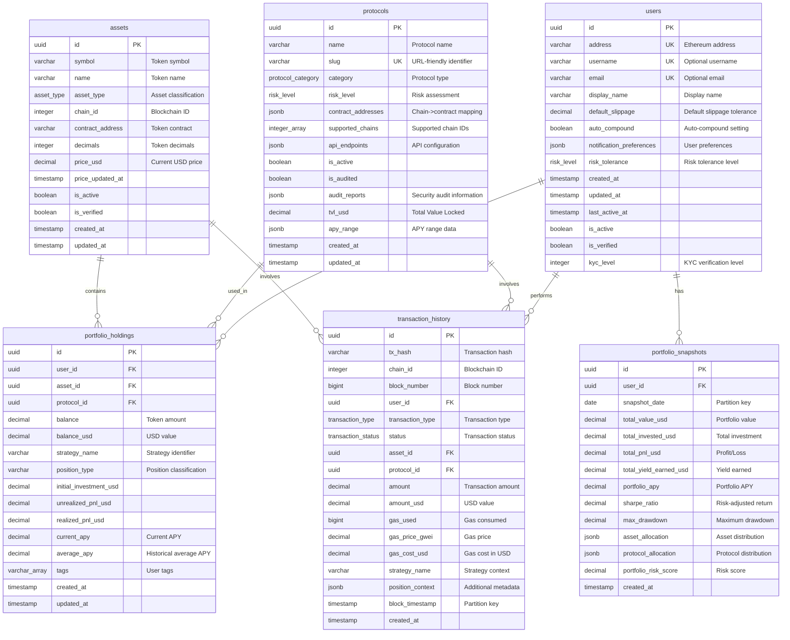

# YieldSensei Database Schema Documentation

This document provides comprehensive documentation for the YieldSensei PostgreSQL database schema, including entity-relationship diagrams, partitioning strategy, and performance considerations.

## Overview

The YieldSensei database architecture follows a multi-tiered approach designed for scalability, performance, and data integrity in a DeFi yield farming platform. The schema supports:

- **User management** with comprehensive profiles and settings
- **Protocol tracking** for DeFi protocols with risk assessment
- **Asset management** with multi-chain support
- **Portfolio tracking** with real-time balance updates
- **Transaction history** with date-based partitioning
- **Performance analytics** with historical snapshots

## Architecture Principles

### 1. **Scalability First**
- Horizontal partitioning for time-series data
- Efficient indexing strategies for common query patterns
- Optimized data types for blockchain-specific values

### 2. **Data Integrity**
- Comprehensive foreign key relationships
- Check constraints for business logic validation
- ACID compliance with proper transaction handling

### 3. **Performance Optimization**
- Strategic indexing for user-centric queries
- Partitioning for historical data management
- Materialized views for complex aggregations

## Entity Relationship Diagram



## Custom Types

The schema uses several PostgreSQL ENUM types for type safety and consistency:

### Asset Type
```sql
CREATE TYPE asset_type AS ENUM (
    'NATIVE',           -- Native blockchain tokens (ETH, MATIC)
    'ERC20',           -- Standard ERC-20 tokens
    'LP_TOKEN',        -- Liquidity provider tokens
    'YIELD_TOKEN',     -- Yield-bearing tokens
    'SYNTHETIC',       -- Synthetic assets
    'NFT'              -- Non-fungible tokens
);
```

### Transaction Type
```sql
CREATE TYPE transaction_type AS ENUM (
    'DEPOSIT',
    'WITHDRAWAL',
    'SWAP',
    'STAKE',
    'UNSTAKE',
    'CLAIM_REWARDS',
    'LIQUIDITY_ADD',
    'LIQUIDITY_REMOVE',
    'BRIDGE',
    'FEE_PAYMENT'
);
```

### Protocol Category
```sql
CREATE TYPE protocol_category AS ENUM (
    'DEX',             -- Decentralized exchanges
    'LENDING',         -- Lending protocols
    'YIELD_FARMING',   -- Yield farming platforms
    'LIQUID_STAKING',  -- Liquid staking protocols
    'DERIVATIVES',     -- Derivatives platforms
    'BRIDGE',          -- Cross-chain bridges
    'OTHER'
);
```

### Risk Level
```sql
CREATE TYPE risk_level AS ENUM (
    'LOW',
    'MEDIUM',
    'HIGH',
    'VERY_HIGH'
);
```

## Partitioning Strategy

### Transaction History Partitioning

The `transaction_history` table uses **range partitioning** by `block_timestamp` for optimal performance:

**Benefits:**
- Efficient querying of recent transactions
- Automatic data aging and archival
- Improved maintenance operations
- Parallel processing capabilities

**Partition Structure:**
```sql
-- Monthly partitions
transaction_history_2024_01  -- Jan 2024
transaction_history_2024_02  -- Feb 2024
...
transaction_history_2024_12  -- Dec 2024
```

**Automatic Partition Management:**
- New partitions created automatically for future months
- Old partitions can be dropped after retention period
- Partition pruning for efficient queries

### Portfolio Snapshots Partitioning

The `portfolio_snapshots` table uses **quarterly partitioning** by `snapshot_date`:

**Benefits:**
- Efficient historical performance analysis
- Reduced storage for analytical queries
- Simplified backup and archival

**Partition Structure:**
```sql
-- Quarterly partitions
portfolio_snapshots_2024_q1  -- Q1 2024
portfolio_snapshots_2024_q2  -- Q2 2024
portfolio_snapshots_2024_q3  -- Q3 2024
portfolio_snapshots_2024_q4  -- Q4 2024
```

## Indexing Strategy

### Primary Indexes

**Users Table:**
```sql
CREATE INDEX idx_users_address ON users(address);           -- Address lookups
CREATE INDEX idx_users_active ON users(is_active);          -- Active user filtering
CREATE INDEX idx_users_last_active ON users(last_active_at DESC); -- Activity sorting
```

**Portfolio Holdings:**
```sql
CREATE INDEX idx_portfolio_user ON portfolio_holdings(user_id);     -- User portfolios
CREATE INDEX idx_portfolio_asset ON portfolio_holdings(asset_id);   -- Asset holders
CREATE INDEX idx_portfolio_protocol ON portfolio_holdings(protocol_id); -- Protocol usage
CREATE INDEX idx_portfolio_user_protocol ON portfolio_holdings(user_id, protocol_id); -- Combined queries
```

**Transaction History (applied to all partitions):**
```sql
CREATE INDEX idx_transaction_user_time ON transaction_history(user_id, block_timestamp DESC);
CREATE INDEX idx_transaction_hash ON transaction_history(tx_hash);   -- Hash lookups
CREATE INDEX idx_transaction_type ON transaction_history(transaction_type); -- Type filtering
CREATE INDEX idx_transaction_user_asset ON transaction_history(user_id, asset_id); -- User-asset queries
```

### Full-Text Search Indexes

```sql
CREATE INDEX idx_protocols_name_search ON protocols USING gin (name gin_trgm_ops);
CREATE INDEX idx_assets_name_search ON assets USING gin (name gin_trgm_ops);
```

## Query Optimization

### Common Query Patterns

**1. User Portfolio Summary**
```sql
-- Optimized with idx_portfolio_user
SELECT * FROM user_portfolio_summary WHERE user_id = $1;
```

**2. Recent User Transactions**
```sql
-- Optimized with idx_transaction_user_time + partition pruning
SELECT * FROM transaction_history 
WHERE user_id = $1 
AND block_timestamp >= NOW() - INTERVAL '30 days'
ORDER BY block_timestamp DESC;
```

**3. Protocol Analytics**
```sql
-- Optimized with idx_portfolio_protocol
SELECT * FROM protocol_tvl_summary WHERE protocol_id = $1;
```

**4. Asset Performance**
```sql
-- Optimized with idx_portfolio_asset
SELECT COUNT(DISTINCT user_id) as holders,
       SUM(balance_usd) as total_value
FROM portfolio_holdings 
WHERE asset_id = $1 AND balance > 0;
```

## Performance Considerations

### Query Performance

**Time-based Queries:**
- Leverage partition pruning for date range queries
- Use covering indexes for common access patterns
- Implement query result caching for expensive aggregations

**User-centric Queries:**
- Primary access pattern optimization around `user_id`
- Efficient pagination with cursor-based approaches
- Pre-computed summary views for dashboard queries

### Storage Optimization

**Data Types:**
- `DECIMAL(28,18)` for precise token amounts
- `DECIMAL(20,2)` for USD values
- `JSONB` for flexible metadata storage
- `INTEGER[]` for chain ID arrays

**Compression:**
- Automatic compression for older partitions
- TOAST storage for large JSONB objects
- Efficient NULL storage for optional fields

## Security Considerations

### Access Control

**Application User:**
```sql
-- Limited permissions for application access
GRANT SELECT, INSERT, UPDATE, DELETE ON ALL TABLES TO yieldsensei_app;
GRANT USAGE, SELECT ON ALL SEQUENCES TO yieldsensei_app;
```

**Data Validation:**
- Check constraints for Ethereum addresses
- Range validation for percentages and ratios
- Business logic validation in triggers

### Data Integrity

**Foreign Key Constraints:**
- Cascade deletes for user data cleanup
- Referential integrity across all relationships
- Constraint deferrability for bulk operations

**Audit Trail:**
- Automatic `updated_at` timestamp triggers
- Immutable transaction history
- Change tracking through application layer

## Maintenance Procedures

### Partition Management

**Monthly Tasks:**
```sql
-- Create new partitions
SELECT create_monthly_partition('transaction_history', '2025-02-01');

-- Check partition sizes
SELECT * FROM get_partition_sizes();
```

**Quarterly Tasks:**
```sql
-- Drop old partitions (older than 24 months)
SELECT drop_old_partitions(24);

-- Update table statistics
ANALYZE transaction_history;
ANALYZE portfolio_snapshots;
```

### Performance Monitoring

**Key Metrics:**
- Query execution times
- Partition sizes and growth
- Index usage statistics
- Connection pool utilization

**Monitoring Queries:**
```sql
-- Slow queries
SELECT query, mean_time, calls 
FROM pg_stat_statements 
ORDER BY mean_time DESC LIMIT 10;

-- Partition information
SELECT * FROM get_partition_sizes();

-- Index usage
SELECT schemaname, tablename, indexname, idx_scan, idx_tup_read
FROM pg_stat_user_indexes 
ORDER BY idx_scan DESC;
```

## Migration and Deployment

### Initial Setup

1. **Create Database:**
   ```bash
   createdb yieldsensei
   psql -d yieldsensei -f src/shared/database/migrations/001_create_initial_schema.sql
   ```

2. **Verify Installation:**
   ```sql
   SELECT version, description, applied_at FROM schema_migrations;
   ```

3. **Load Sample Data:**
   ```sql
   -- Sample data is included in migration
   SELECT COUNT(*) FROM protocols; -- Should return 5
   SELECT COUNT(*) FROM assets;    -- Should return 10
   ```

### Future Migrations

**Migration File Naming:**
```
002_add_user_preferences.sql
003_add_protocol_metrics.sql
004_optimize_indexes.sql
```

**Migration Template:**
```sql
-- Migration: XXX_description.sql
BEGIN;

-- Schema changes here

-- Update migration tracking
INSERT INTO schema_migrations (version, description) 
VALUES ('XXX', 'Description of changes');

COMMIT;
```

## Backup and Recovery

### Backup Strategy

**Full Backup (Weekly):**
```bash
pg_dump -Fc yieldsensei > backup_$(date +%Y%m%d).dump
```

**Incremental Backup (Daily):**
```bash
# Using WAL-E or similar tool
wal-e backup-push /var/lib/postgresql/data
```

**Partition-level Backup:**
```bash
# Backup specific partition
pg_dump -t transaction_history_2024_12 yieldsensei > partition_backup.sql
```

### Recovery Procedures

**Point-in-time Recovery:**
```bash
# Restore to specific timestamp
pg_restore -C -d postgres backup.dump
psql -d yieldsensei -c "SELECT pg_drop_replication_slot('slot_name');"
```

**Partition Recovery:**
```sql
-- Drop corrupted partition
DROP TABLE transaction_history_2024_12;

-- Recreate from backup
\i partition_backup.sql
```

## Conclusion

This PostgreSQL schema design provides a robust foundation for the YieldSensei platform with:

- **Scalable architecture** supporting millions of transactions
- **Efficient partitioning** for time-series data management
- **Comprehensive indexing** for optimal query performance
- **Data integrity** through constraints and validation
- **Flexible metadata** storage for evolving requirements

The design balances performance, maintainability, and extensibility while adhering to PostgreSQL best practices for high-throughput financial applications. 