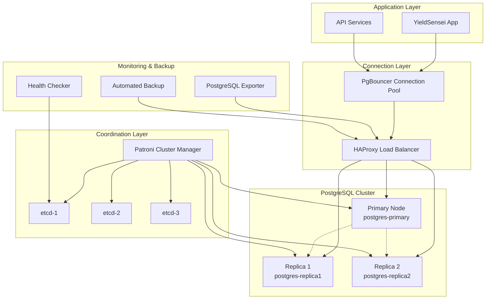

# YieldSensei PostgreSQL High Availability Architecture

This document describes the comprehensive PostgreSQL High Availability (HA) setup for YieldSensei, designed to provide zero-downtime operation, automatic failover, and optimal performance for DeFi yield farming operations.

## Architecture Overview

The PostgreSQL HA setup provides a robust, scalable, and fault-tolerant database infrastructure capable of handling high-frequency DeFi transactions with sub-200ms response times.

### High-Level Architecture Diagram



## Component Overview

### 1. **etcd Cluster (Coordination)**
- **Purpose**: Distributed consensus and configuration store for Patroni
- **Components**: 3-node etcd cluster (etcd1, etcd2, etcd3)
- **High Availability**: Requires majority (2/3) nodes for operation
- **Configuration**: Automatic leader election and member discovery

### 2. **Patroni Cluster Management**
- **Purpose**: Automatic failover and PostgreSQL cluster management
- **Features**:
  - Automatic leader election
  - Health monitoring and failure detection
  - Synchronous replication management
  - Rolling upgrades support
- **Configuration**: Optimized for DeFi workloads with 30-second TTL

### 3. **PostgreSQL Nodes**
- **Primary Node**: Handles all write operations and critical transactions
- **Replica Nodes**: Handle read operations and provide failover capability
- **Replication**: Synchronous replication for data consistency
- **Performance**: Optimized for high-frequency transactions

### 4. **HAProxy Load Balancer**
- **Purpose**: Intelligent traffic routing and health checking
- **Features**:
  - Write traffic → Primary node
  - Read traffic → Replica nodes with primary fallback
  - Health checks via Patroni REST API
  - Connection rate limiting and monitoring
- **Ports**:
  - `5432`: Write operations (Primary)
  - `5433`: Read operations (Replicas)
  - `8404`: Statistics dashboard

### 5. **PgBouncer Connection Pooling**
- **Purpose**: Efficient connection management and pooling
- **Configuration**:
  - Transaction-level pooling for DeFi operations
  - Separate pools for read/write operations
  - 1000 max client connections
  - Optimized for high-frequency trading
- **Port**: `6432`

### 6. **Monitoring and Backup**
- **PostgreSQL Exporter**: Prometheus metrics for monitoring
- **Automated Backup**: Daily backups with retention policies
- **Health Checker**: Custom monitoring and alerting service

## Network Architecture

### Port Configuration

| Service | Port | Purpose | Access |
|---------|------|---------|---------|
| HAProxy Write | 5432 | Primary PostgreSQL access | Application |
| HAProxy Read | 5433 | Replica PostgreSQL access | Application |
| PgBouncer | 6432 | Connection pooling | Application |
| HAProxy Stats | 8404 | Load balancer statistics | Monitoring |
| Patroni API | 8008 | Cluster management | Internal |
| PostgreSQL Exporter | 9187 | Prometheus metrics | Monitoring |
| etcd | 2379 | Client communication | Internal |
| etcd Peer | 2380 | Peer communication | Internal |

### Connection Flow

1. **Write Operations**:
   ```
   Application → PgBouncer (6432) → HAProxy (5432) → Primary Node
   ```

2. **Read Operations**:
   ```
   Application → PgBouncer (6432) → HAProxy (5433) → Replica Nodes
   ```

3. **Failover Scenario**:
   ```
   Primary Failure → Patroni Detects → Promotes Replica → HAProxy Routes Traffic
   ```

## Configuration Details

### PostgreSQL Optimization for DeFi

#### Primary Node Configuration
- **Connections**: 200 max connections
- **Memory**: 512MB shared_buffers, 1536MB effective_cache_size
- **WAL**: 1GB min_wal_size, 4GB max_wal_size, compression enabled
- **Replication**: Synchronous with 1 replica confirmation
- **Autovacuum**: Optimized for high-frequency transactions

#### Replica Node Configuration
- **Read Optimization**: Higher parallel workers for analytics
- **Hot Standby**: Enabled with feedback for query optimization
- **Lag Monitoring**: 30-second streaming delay threshold
- **Query Optimization**: Increased work_mem for complex analytics

### Patroni Configuration

#### Cluster Settings
- **TTL**: 30 seconds (fast failure detection)
- **Loop Wait**: 10 seconds (frequent health checks)
- **Synchronous Mode**: Enabled for data consistency
- **Automatic Failover**: Enabled with 1MB lag threshold

#### Health Checks
- **REST API**: Health monitoring on port 8008
- **PostgreSQL**: Connection and query validation
- **Replication**: Lag monitoring and alerting

### HAProxy Load Balancing

#### Health Check Strategy
```haproxy
# Patroni REST API health check
tcp-check connect port 8008
tcp-check send-binary [HTTP GET request]
tcp-check expect string "HTTP/1.1 200"

# PostgreSQL connection check
option pgsql-check user patroni
```

#### Traffic Routing Rules
- **Primary Backend**: First available primary node
- **Replica Backend**: Least connections algorithm
- **Fallback**: Primary serves reads if all replicas down
- **Rate Limiting**: 20 connections per IP per 3 seconds

## Deployment Guide

### Prerequisites
- Docker and Docker Compose installed
- Minimum 8GB RAM and 4 CPU cores
- 50GB+ storage for database volumes
- Network connectivity between all nodes

### Quick Start

1. **Clone and Navigate**:
   ```bash
   git clone https://github.com/yieldsensei/yieldsensei.git
   cd yieldsensei/deployments/postgresql-ha
   ```

2. **Initialize Cluster**:
   ```bash
   ./scripts/setup-cluster.sh init
   ```

3. **Verify Status**:
   ```bash
   ./scripts/setup-cluster.sh status
   ```

### Step-by-Step Deployment

#### 1. Environment Setup
```bash
# Generate secure environment file
./scripts/setup-cluster.sh init

# Review and customize environment variables
vim .env
```

#### 2. Start Core Services
```bash
# Start etcd cluster
docker-compose up -d etcd1 etcd2 etcd3

# Verify etcd health
docker-compose exec etcd1 etcdctl endpoint health
```

#### 3. Initialize PostgreSQL Cluster
```bash
# Start primary node
docker-compose up -d postgres-primary

# Wait for primary to be ready (30-60 seconds)
docker-compose logs -f postgres-primary

# Start replica nodes
docker-compose up -d postgres-replica1 postgres-replica2
```

#### 4. Start Support Services
```bash
# Start load balancer and connection pooling
docker-compose up -d haproxy pgbouncer

# Start monitoring and backup services
docker-compose up -d postgres-exporter postgres-backup postgres-health-checker
```

### Configuration Customization

#### Environment Variables (.env)
```bash
# PostgreSQL Configuration
POSTGRES_PASSWORD=your_secure_password
POSTGRES_REPLICATION_PASSWORD=your_replication_password

# Monitoring and Alerting
SLACK_WEBHOOK_URL=https://hooks.slack.com/your/webhook/url
ALERT_WEBHOOK_URL=https://your-monitoring-system.com/webhook

# Performance Tuning
REPLICATION_LAG_THRESHOLD=10  # seconds
FAILOVER_THRESHOLD=60         # seconds
```

#### Custom PostgreSQL Settings
Create custom configuration files:
```bash
# Custom primary settings
echo "max_connections = 300" > config/custom-primary.conf

# Custom replica settings  
echo "max_parallel_workers_per_gather = 6" > config/custom-replica.conf
```

## Monitoring and Alerting

### Key Metrics to Monitor

#### Database Performance
- **Transaction Rate**: Transactions per second by type
- **Query Performance**: Average execution time and slow queries
- **Connection Usage**: Active connections vs. limits
- **Cache Hit Ratio**: Buffer cache efficiency

#### Replication Health
- **Replication Lag**: Lag in bytes and time
- **Replica Status**: Connection state and sync status
- **Failover Events**: Automatic and manual failovers

#### Resource Utilization
- **CPU Usage**: Per-node CPU utilization
- **Memory Usage**: Shared buffers and cache usage
- **Disk I/O**: Read/write operations and latency
- **Network**: Replication traffic and client connections

### Monitoring Dashboards

#### HAProxy Statistics
- **URL**: `http://localhost:8404/stats`
- **Credentials**: admin / yieldsensei-stats
- **Features**: Real-time connection status, health checks, traffic stats

#### PostgreSQL Metrics
- **Endpoint**: `http://localhost:9187/metrics`
- **Format**: Prometheus metrics
- **Custom Queries**: DeFi-specific metrics in `postgres-exporter-queries.yaml`

### Alert Configuration

#### Critical Alerts
```yaml
# Replication lag > 10 seconds
- alert: PostgreSQLReplicationLag
  expr: pg_replication_lag > 10
  
# Primary node down
- alert: PostgreSQLPrimaryDown
  expr: up{job="postgres-primary"} == 0
  
# High connection usage (>80%)
- alert: PostgreSQLHighConnections
  expr: pg_connections_active / pg_connections_max > 0.8
```

#### Warning Alerts
```yaml
# Slow queries detected
- alert: PostgreSQLSlowQueries
  expr: pg_slow_queries_mean_time > 1000

# High transaction volume
- alert: PostgreSQLHighTransactionRate
  expr: rate(pg_transaction_rate[5m]) > 1000
```

## Backup and Recovery

### Automated Backup Strategy

#### Backup Schedule
- **Daily**: Full database backup at 2 AM
- **Retention**: 7 days, 4 weeks, 6 months
- **Storage**: Local volumes with optional cloud sync
- **Verification**: Automatic backup integrity checks

#### Backup Configuration
```bash
# Environment variables for backup service
SCHEDULE="0 2 * * *"              # Daily at 2 AM
BACKUP_KEEP_DAYS=7                # 7 daily backups
BACKUP_KEEP_WEEKS=4               # 4 weekly backups  
BACKUP_KEEP_MONTHS=6              # 6 monthly backups
```

### Manual Backup and Restore

#### Create Manual Backup
```bash
# Full database backup
./scripts/setup-cluster.sh backup

# Schema-only backup
docker-compose exec postgres-primary pg_dump \
  -h localhost -U yieldsensei_app -s yieldsensei > schema_backup.sql
```

#### Restore from Backup
```bash
# Full restore (destructive)
./scripts/setup-cluster.sh restore /path/to/backup.sql

# Selective restore
docker-compose exec postgres-primary psql \
  -h localhost -U yieldsensei_app -d yieldsensei \
  -c "\copy table_name from '/path/to/data.csv' csv header"
```

### Point-in-Time Recovery (PITR)

#### WAL Archiving Setup
```sql
-- Enable WAL archiving (in postgresql.conf)
wal_level = replica
archive_mode = on
archive_command = 'cp %p /var/lib/postgresql/wal_archive/%f'
```

#### Recovery Process
```bash
# Stop cluster
docker-compose stop postgres-primary postgres-replica1 postgres-replica2

# Restore from base backup
tar -xzf base_backup.tar.gz -C /var/lib/postgresql/data/

# Configure recovery
echo "restore_command = 'cp /var/lib/postgresql/wal_archive/%f %p'" > recovery.conf
echo "recovery_target_time = '2024-01-20 14:30:00'" >> recovery.conf

# Start recovery
docker-compose up -d postgres-primary
```

## Failover and Disaster Recovery

### Automatic Failover Process

#### Failure Detection
1. **Patroni Health Checks**: Every 10 seconds
2. **Network Partition Detection**: Via etcd consensus
3. **PostgreSQL Process Monitoring**: Connection validation
4. **Custom Health Checks**: Application-level monitoring

#### Failover Sequence
1. **Failure Detection**: Patroni detects primary failure
2. **Leader Election**: etcd coordinates new leader selection
3. **Replica Promotion**: Best replica promoted to primary
4. **Client Redirection**: HAProxy redirects traffic to new primary
5. **Cleanup**: Failed node marked as replica when recovered

#### Failover Timing
- **Detection Time**: 10-30 seconds
- **Promotion Time**: 5-15 seconds
- **Total Downtime**: 15-45 seconds typical

### Manual Failover

#### Planned Maintenance
```bash
# Graceful failover to specific replica
./scripts/setup-cluster.sh failover postgres-replica1

# Verify new cluster state
./scripts/setup-cluster.sh status
```

#### Emergency Failover
```bash
# Force immediate failover
docker-compose exec postgres-primary patronictl failover \
  --master postgres-primary --candidate postgres-replica1 --force
```

### Disaster Recovery Scenarios

#### Complete Cluster Loss
1. **Restore from Backup**: Use latest full backup
2. **Rebuild Cluster**: Initialize new primary and replicas
3. **Data Validation**: Verify data integrity and completeness
4. **Application Testing**: Validate all functionality

#### Partial Node Loss
1. **Single Node**: Automatic failover, rebuild failed node
2. **Majority Loss**: Manual intervention required
3. **Network Partition**: Automatic recovery when connectivity restored

## Performance Tuning

### Database-Level Optimizations

#### Memory Configuration
```postgresql
# Primary node memory settings
shared_buffers = 512MB                    # 25% of RAM
effective_cache_size = 1536MB             # 75% of RAM
work_mem = 8MB                            # Per-operation memory
maintenance_work_mem = 128MB              # Maintenance operations
```

#### I/O Optimization
```postgresql
# Checkpoint and WAL settings
checkpoint_completion_target = 0.9        # Spread checkpoint I/O
wal_buffers = 16MB                        # WAL buffer size
checkpoint_timeout = 5min                 # Checkpoint frequency
max_wal_size = 4GB                        # Maximum WAL size
```

#### Query Optimization
```postgresql
# Query planning and execution
default_statistics_target = 100           # Statistics detail level
random_page_cost = 1.1                    # SSD optimization
effective_io_concurrency = 200            # Concurrent I/O operations
max_parallel_workers_per_gather = 2       # Parallel query workers
```

### Connection Pool Optimization

#### PgBouncer Tuning
```ini
# Connection limits
max_client_conn = 1000                    # Maximum client connections
default_pool_size = 20                    # Default pool size per DB/user
reserve_pool_size = 5                     # Emergency connections
server_idle_timeout = 600                 # Idle server timeout
```

#### HAProxy Optimization
```haproxy
# Connection management
maxconn 2000                              # Global connection limit
timeout connect 5000ms                    # Connection timeout
timeout client 50000ms                    # Client timeout
timeout server 50000ms                    # Server timeout
```

### Operating System Tuning

#### Kernel Parameters
```bash
# Network optimization
echo 'net.core.somaxconn = 1024' >> /etc/sysctl.conf
echo 'net.ipv4.tcp_max_syn_backlog = 4096' >> /etc/sysctl.conf

# Memory management
echo 'vm.swappiness = 1' >> /etc/sysctl.conf
echo 'vm.overcommit_memory = 2' >> /etc/sysctl.conf
```

#### File System
```bash
# Mount options for data volumes
mount -o noatime,nodiratime /dev/sdb1 /var/lib/postgresql/data
```

## Security Considerations

### Network Security

#### Firewall Configuration
```bash
# Allow only necessary ports
ufw allow 5432/tcp                        # PostgreSQL primary
ufw allow 5433/tcp                        # PostgreSQL replicas  
ufw allow 6432/tcp                        # PgBouncer
ufw allow 8404/tcp                        # HAProxy stats
ufw deny 2379/tcp                         # etcd (internal only)
```

#### SSL/TLS Configuration
```postgresql
-- Enable SSL for external connections
ssl = on
ssl_cert_file = '/etc/ssl/certs/postgresql.crt'
ssl_key_file = '/etc/ssl/private/postgresql.key'
ssl_ca_file = '/etc/ssl/certs/ca.crt'
```

### Authentication and Authorization

#### User Management
```sql
-- Create application users with minimal privileges
CREATE USER yieldsensei_app WITH PASSWORD 'secure_password';
GRANT CONNECT ON DATABASE yieldsensei TO yieldsensei_app;
GRANT USAGE ON SCHEMA public TO yieldsensei_app;
GRANT SELECT, INSERT, UPDATE, DELETE ON ALL TABLES IN SCHEMA public TO yieldsensei_app;

-- Create read-only user for analytics
CREATE USER yieldsensei_read WITH PASSWORD 'readonly_password';
GRANT CONNECT ON DATABASE yieldsensei TO yieldsensei_read;
GRANT USAGE ON SCHEMA public TO yieldsensei_read;
GRANT SELECT ON ALL TABLES IN SCHEMA public TO yieldsensei_read;
```

#### Row-Level Security
```sql
-- Enable RLS for user data isolation
ALTER TABLE users ENABLE ROW LEVEL SECURITY;
CREATE POLICY user_isolation ON users FOR ALL TO yieldsensei_app
  USING (id = current_setting('app.current_user_id')::uuid);
```

### Data Encryption

#### Encryption at Rest
```bash
# Enable filesystem encryption
cryptsetup luksFormat /dev/sdb1
cryptsetup luksOpen /dev/sdb1 postgres_data
mkfs.ext4 /dev/mapper/postgres_data
```

#### Encryption in Transit
```postgresql
# Require SSL for sensitive operations
hostssl all yieldsensei_app 0.0.0.0/0 md5
hostssl replication replicator 0.0.0.0/0 md5
```

## Troubleshooting

### Common Issues and Solutions

#### Cluster Won't Start
```bash
# Check etcd cluster health
docker-compose exec etcd1 etcdctl endpoint health

# Check Patroni logs
docker-compose logs patroni-primary

# Verify network connectivity
docker-compose exec postgres-primary ping postgres-replica1
```

#### Replication Lag Issues
```bash
# Check replication status
docker-compose exec postgres-primary psql -c "SELECT * FROM pg_stat_replication;"

# Monitor WAL generation rate
docker-compose exec postgres-primary psql -c "SELECT pg_current_wal_lsn();"

# Check replica lag in bytes
docker-compose exec postgres-replica1 psql -c "SELECT pg_last_wal_receive_lsn(), pg_last_wal_replay_lsn();"
```

#### Connection Issues
```bash
# Check connection pool status
docker-compose exec pgbouncer psql -p 6432 -h localhost -U postgres pgbouncer -c "SHOW POOLS;"

# Verify HAProxy backend status
curl http://localhost:8404/stats

# Test direct PostgreSQL connection
docker-compose exec postgres-primary psql -h localhost -U yieldsensei_app yieldsensei
```

#### Performance Issues
```bash
# Check slow queries
docker-compose exec postgres-primary psql -c "SELECT query, mean_time, calls FROM pg_stat_statements ORDER BY mean_time DESC LIMIT 10;"

# Monitor active connections
docker-compose exec postgres-primary psql -c "SELECT count(*), state FROM pg_stat_activity GROUP BY state;"

# Check table statistics
docker-compose exec postgres-primary psql -c "SELECT schemaname, tablename, seq_scan, idx_scan FROM pg_stat_user_tables ORDER BY seq_scan DESC;"
```

### Debug Commands

#### Cluster State Inspection
```bash
# Patroni cluster status
docker-compose exec postgres-primary patronictl list

# etcd cluster members
docker-compose exec etcd1 etcdctl member list

# PostgreSQL replication status
docker-compose exec postgres-primary psql -c "\x" -c "SELECT * FROM pg_stat_replication;"
```

#### Log Analysis
```bash
# PostgreSQL logs
docker-compose logs postgres-primary | grep ERROR

# Patroni logs
docker-compose logs postgres-primary | grep patroni

# HAProxy logs
docker-compose logs haproxy | grep "backend.*down"
```

## Maintenance Procedures

### Regular Maintenance Tasks

#### Weekly Tasks
- Monitor replication lag and performance metrics
- Review slow query logs and optimize problematic queries
- Check backup integrity and retention policies
- Update connection pool statistics

#### Monthly Tasks
- Analyze database growth and partition performance
- Review and rotate log files
- Update PostgreSQL and system packages
- Test failover procedures in staging environment

#### Quarterly Tasks
- Full backup and restore testing
- Performance baseline review and tuning
- Security audit and password rotation
- Disaster recovery plan validation

### Upgrade Procedures

#### PostgreSQL Minor Version Upgrade
```bash
# Rolling upgrade process
# 1. Upgrade replicas first
docker-compose stop postgres-replica1
# Update image version in docker-compose.yml
docker-compose up -d postgres-replica1

# 2. Repeat for replica2
# 3. Finally upgrade primary (requires brief downtime)
```

#### Major Version Upgrade
```bash
# 1. Full backup
./scripts/setup-cluster.sh backup

# 2. Test upgrade in staging environment
# 3. Schedule maintenance window
# 4. Perform upgrade with pg_upgrade
# 5. Validate data integrity
# 6. Update applications for compatibility
```

## Conclusion

This PostgreSQL High Availability architecture provides YieldSensei with:

- **Zero-downtime operation** through automatic failover
- **Scalable read performance** via intelligent load balancing  
- **Data consistency** through synchronous replication
- **Operational excellence** via comprehensive monitoring
- **Disaster resilience** through automated backups and recovery procedures

The architecture is designed to handle the demanding requirements of DeFi operations while maintaining the flexibility to scale as the platform grows. 